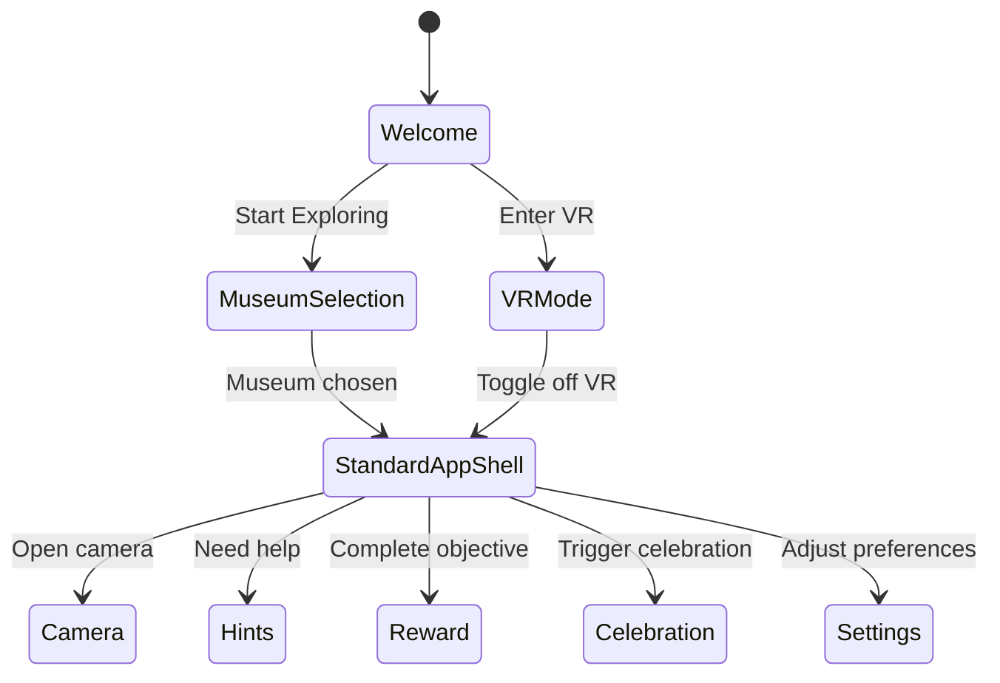
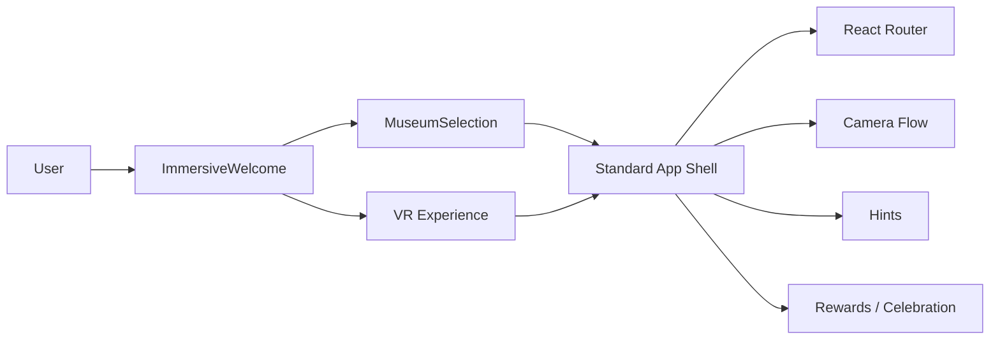
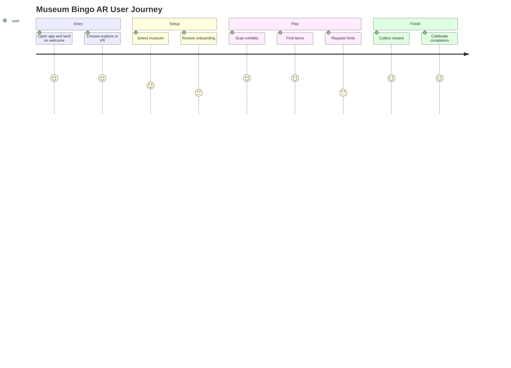
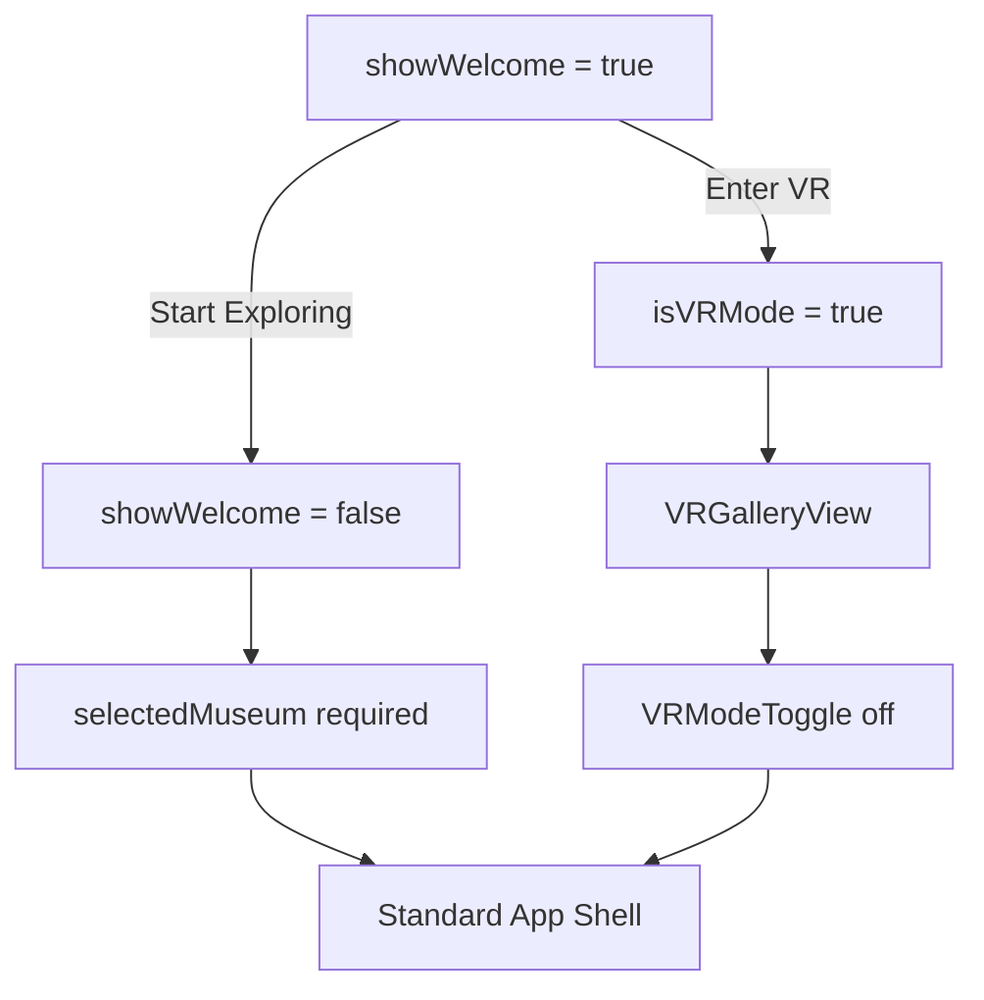

# Museum Bingo AR App Design

Museum Bingo AR is a Figma-generated Vite + React + TypeScript code bundle that turns a museum visit into a playful scavenger-hunt experience with camera-assisted discovery, guided onboarding, rewards, and a VR mode for immersive exploration.

---

## Table of Contents

* [Overview](#overview)
* [Product Vision](#product-vision)
* [Repository Structure](#repository-structure)
* [App Architecture](#app-architecture)
* [Navigation and Routes](#navigation-and-routes)
* [State Model](#state-model)
* [Screen-by-Screen Guide](#screen-by-screen-guide)
* [Technical Diagrams](#technical-diagrams)
* [Getting Started](#getting-started)
* [Development Notes](#development-notes)
* [Extending the App](#extending-the-app)
* [Accessibility and UX Considerations](#accessibility-and-ux-considerations)
* [Known Gaps and Next Steps](#known-gaps-and-next-steps)
* [License / Attribution](#license--attribution)

---

## Overview

Museum Bingo AR is designed to make museum exploration feel like a game. Users enter through an immersive welcome screen, pick a museum, then move through a guided experience that can include camera-based discovery, hints, rewards, leaderboards, settings, and a VR gallery mode.

The experience is intentionally modular. Each major screen is isolated as a component, which makes the app easier to extend, test, and redesign without rewriting the entire flow.

---

## Product Vision

The app blends three ideas:

1. **Museum exploration** — users move through exhibits and discover artworks or clues.
2. **Game mechanics** — users collect items, earn rewards, and compare progress.
3. **Immersive experiences** — VR mode offers a parallel gallery flow for more immersive interaction.

The result is a museum companion that feels less like a utility app and more like a guided adventure.

---

## Repository Structure

The repository is organized as a generated frontend bundle. A practical high-level structure looks like this:

```text
MuseumBingoARAppdesign/
├── src/
│   ├── app/
│   │   └── App.tsx
│   └── components/
├── README.md
├── package.json
├── vite.config.ts
├── postcss.config.mjs
└── ...
```

This structure reflects a Figma-to-code handoff: the app is component-driven, route-based, and ready for iterative UI work.

---

## App Architecture

The application entry point is a single `App` component that controls top-level flow and routing. It uses React state to manage onboarding and mode switching, then hands off most UI behavior to leaf components.

At a conceptual level:

* `ImmersiveWelcome` handles the first impression.
* `MuseumSelection` handles destination choice.
* `BrowserRouter` manages page-level navigation for the standard app shell.
* `VRGalleryView` and `VRModeToggle` form the VR experience.
* Additional screens cover camera usage, hints, rewards, leaderboard, settings, and celebration.

The app therefore has two control layers:

* a **state-driven gate** for the opening and VR experience,
* and a **route-driven shell** for the everyday museum journey.

---

## Navigation and Routes

The current router in `App.tsx` maps these routes:

* `/` → redirects to `/home`
* `/home` → `HomeScreen`
* `/camera` → `EnhancedCameraScreen`
* `/camera-onboarding` → `CameraOnboardingWrapper`
* `/camera-settings` → `CameraSettings`
* `/hints` → `HintScreen`
* `/multiplayer` → `VRMultiplayerRoom`
* `/settings` → `SettingsScreen`
* `/vr-settings` → `VRComfortSettings`
* `/reward` → `RewardScreen`
* `/celebration` → `VRCelebrationWrapper`

A compact route map:

```mermaid
flowchart TD
    A[/] --> B[/home]
    B --> C[/camera]
    B --> D[/camera-onboarding]
    B --> E[/camera-settings]
    B --> F[/hints]
    B --> G[/multiplayer]
    B --> H[/settings]
    B --> I[/vr-settings]
    B --> J[/reward]
    B --> K[/celebration]
```

The route list strongly suggests the app is designed for progressive discovery: users start at home, then move into capture, hinting, rewards, and social/immersive experiences.

---

## State Model

The top-level `App` component currently tracks five pieces of state:

* `showWelcome`
* `selectedMuseum`
* `isVRMode`
* `foundItems`
* `showCameraOnboarding`

The key interaction pattern is simple:

* If the welcome screen is active, the app renders `ImmersiveWelcome`.
* If no museum has been selected and VR mode is off, the app renders `MuseumSelection`.
* If VR mode is on, the app renders the VR gallery experience.
* Otherwise, the standard router-based shell renders.

The item-collection helper ensures each discovered artwork ID is stored once:

```ts
const handleArtworkFound = (id: number) => {
  if (!foundItems.includes(id)) {
    setFoundItems([...foundItems, id]);
  }
};
```

This is a clean, minimal pattern for progress tracking and avoids duplicate rewards for the same discovery.

### State flow diagram



---

## Screen-by-Screen Guide

### ImmersiveWelcome

The welcome screen is the entry experience. It has two main actions: start exploring normally or enter VR mode immediately. This makes onboarding feel intentional rather than abrupt.

### MuseumSelection

This screen appears before the standard app shell when no museum is selected. It acts as a gate that personalizes the experience by museum context.

### HomeScreen

The main landing page inside the standard shell. This is likely where the user sees primary navigation and next actions. The exact UI is component-based, which makes it easy to replace or restyle later.

### EnhancedCameraScreen

This is the camera-centered interaction surface. In a museum bingo flow, this is the natural place to detect artworks, prompt scanning, or confirm discoveries.

### CameraOnboardingWrapper

This route isolates the first-time camera explanation flow. A dedicated onboarding screen is useful because camera permissions and usage need more guidance than ordinary navigation.

### CameraSettings

A dedicated settings page for camera-related preferences. This keeps operational controls separate from gameplay controls.

### HintScreen

This is the support layer for users who get stuck. For a museum bingo app, hint delivery is essential to keeping the game moving.

### RewardScreen

A reward route gives the app room to celebrate progress, show badges, or reveal unlocked content.

### LeaderboardScreen

This component is imported in the app bundle, indicating a competitive or social layer is planned in the design system even though it is not currently routed in the top-level switch shown in `App.tsx`.

### SettingsScreen

A standard settings page for general app preferences. This is where global app state should stay out of the main interaction loop.

### BottomNav

The bottom navigation anchors the standard app shell and keeps primary destinations easy to reach. This is especially important in mobile-first museum contexts.

### VRGalleryView, VRModeToggle, VRComfortSettings, VRMultiplayerRoom, VRCelebrationWrapper

These components define the app’s immersive layer and adjacent social/comfort features. Their presence suggests the product is not just a 2D scavenger hunt, but a hybrid experience with immersive viewing, comfort tuning, multiplayer support, and celebration flows.

---

## Technical Diagrams

### 1) Architecture



### 2) User Journey



### 3) State Flow



---

## Getting Started

Typical local workflow:

```bash
git clone <repo-url>
cd MuseumBingoARAppdesign
npm i
npm run dev
```

Then open the local Vite dev URL in your browser.

---

## Development Notes

This codebase is well suited to iterative UI work because most features are already separated into components. The current top-level `App.tsx` is only responsible for orchestration, not implementation details, which keeps the architecture easy to reason about.

A few practical notes:

* Keep route-level UI in components, not in `App.tsx`.
* Store transient discovery state close to gameplay logic.
* Preserve the separation between VR, standard app shell, and onboarding.
* Treat the welcome flow as an experience, not just a splash screen.

---

## Extending the App

Good next additions would be:

* persistent progress storage,
* museum-specific content packs,
* camera permission diagnostics,
* accessibility toggles,
* badge history,
* multiplayer room status,
* and analytics for completion rates.

A sensible implementation rule is to keep the top-level router thin and make each feature own its own state. That pattern already fits the current app structure.

---

## Accessibility and UX Considerations

Museum apps are often used on-site, in motion, and under time pressure. That means the UI should favor:

* large tap targets,
* clear contrast,
* short instructions,
* low-friction camera prompts,
* and visible progress feedback.

VR needs extra care:

* comfort controls,
* motion-sensitive defaults,
* readable labels,
* and an easy exit back to the standard app shell.

The presence of `VRComfortSettings` and `VRModeToggle` suggests those concerns were already anticipated in the design.

---

## Known Gaps and Next Steps

Based on the current top-level app wiring, the following areas appear ready for deeper implementation:

* `LeaderboardScreen` is imported but not shown in the active route list.
* `showCameraOnboarding` is tracked in state, but its full flow is not visible in the top-level snippet.
* A few imported components may be designed for future use or conditional access rather than immediate routing.

That is normal for a generated code bundle: the scaffold is in place, and the implementation can be tightened around the exact product requirements.

---

## License / Attribution

This project is a generated code bundle for the Museum Bingo AR App Design and points back to the associated Figma design source.

---

## Closing

Museum Bingo AR has a strong foundation: a clean route map, a small number of top-level state gates, and a component-first architecture that is easy to evolve. The current structure is already organized around the full user journey — welcome, selection, play, help, reward, and immersive VR — which makes it a solid base for a polished museum experience.
